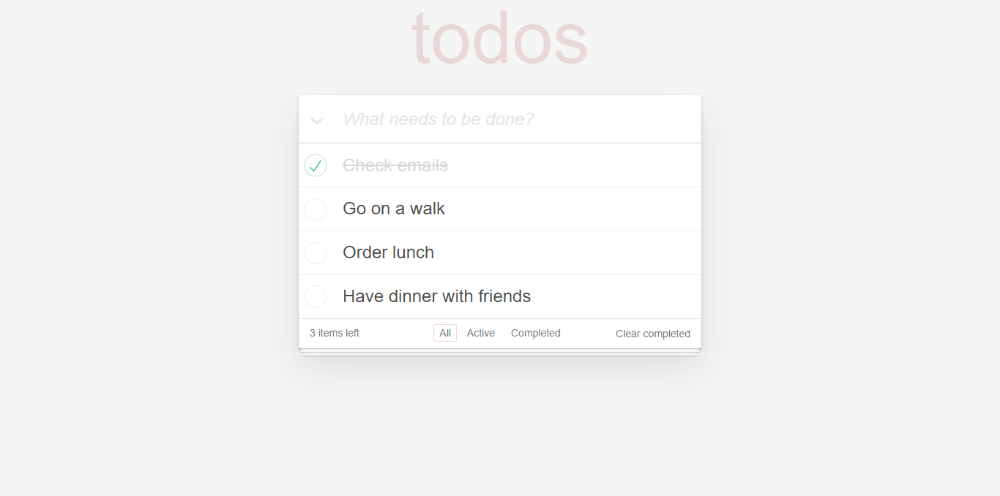

# TO DO APP
## Fimple React Bootcamp Week 3 Assignment
- This project is an assignment as part of [Patika](patika.dev) Fimple React Bootcamp. 
- TO DO APP is developed with using React.

## User Interface

## What can user do in TO DO APP?
User can create or delete a task, change a task status as completed or active one by one or all of them at once, delete  all the completed tasks and display the tasks seperately according to active or completed status.

[Assignment Link](https://academy.patika.dev/tr/courses/react/odev2)
